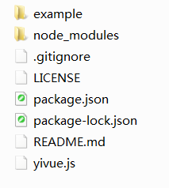
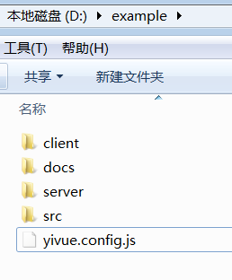
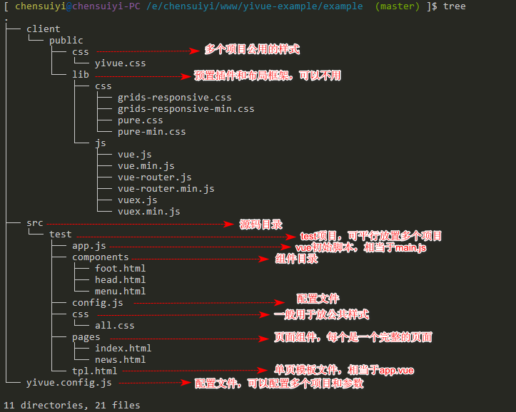
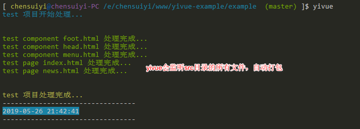
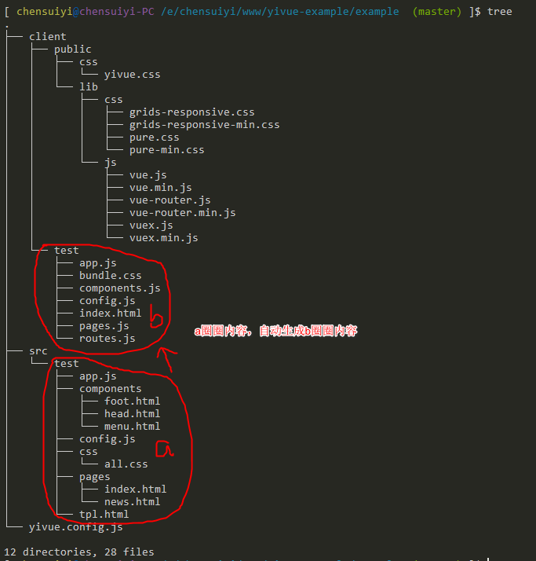
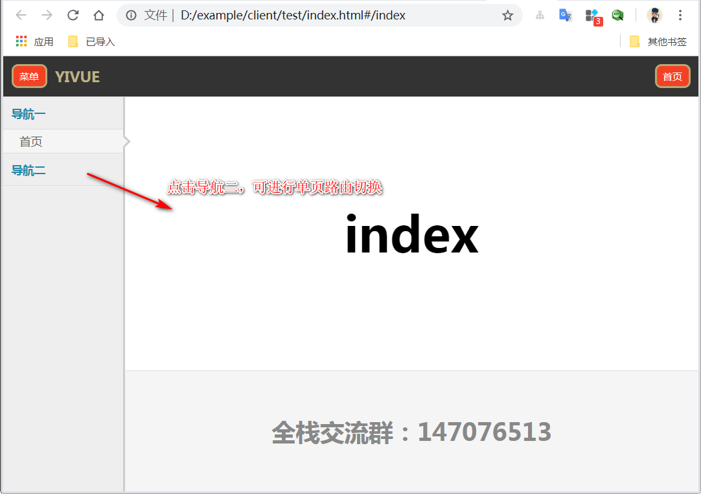
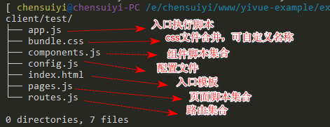

## YIVUE
	用简单易懂的方式，开发基于VUE的单页应用。

|名称|说明|
|---|---|
|项目|yivue|
|用途|使用简单易懂的方式开发VUE单页应用的构建处理工具。|
|版本|3.0.0|
|更新时间|2019年05月12日|
|作者|陈随易|
|邮箱|bimostyle@qq.com|
|知乎|[知乎陈随易](https://www.zhihu.com/people/chensuiyi)|
|全栈交流群|147076513|

## 使用方式

### 全局安装`yiuve`到本地 
	npm install -g yivue

#### 结构如下


### 复制本模块下的`example`示例项目到任意自己喜欢的目录下。
	这里，我放到了D盘根目录下


### 项目组织结构一览


src目录下的每个直接子目录，都是一个单独的单页项目。如果要同时开发后台单页，官网单页，用户后台单页等等多个单页项目，直接复制`src`目录下的`test`目录，并修改文件名，配置到`yivue.config.js`文件中即可。
### 直接在本目录下执行`yivue`命令。
	yivue
#### 结果如下


### 查看当前的目录结构


### 用浏览器打`开index.html`文件


### 生成单页项目结构


	没错！！！就是这么简简单单的结构，没有任何其他多余的东西！！！

## 源代码编写

### 单页模板文件`tpl.html`
```html 
<!DOCTYPE HTML>
<html>

<head>
	<title>yivue demo</title>
	<meta charset="utf-8" />
	<meta name="viewport"
		content="width=device-width,initial-scale=1.0,minimum-scale=1.0,maximum-scale=1.0,user-scalable=no" />
	<link rel="stylesheet" type="text/css" href="../public/css/yivue.css">
</head>

<body>
	<div class="YiVue" id="YiVue">
		<router-view name="head"></router-view>
		<router-view name="menu"></router-view>
		<router-view name="body"></router-view>
		<router-view name="foot"></router-view>
	</div>
</body>

<!--[组件文件]-->
<!--[:yivue_components]-->
<!--[组件文件]-->

<!--[页面文件]-->
<!--[:yivue_pages]-->
<!--[页面文件]-->

<!-- vue库 -->
<script src="../public/lib/vue.min.js"></script>
<!-- vue-router 路由库 -->
<script src="../public/lib/vue-router.min.js"></script>
<!-- 配置文件 -->
<script src="config.js"></script>
<!-- 组件资源 -->
<script src="components.js"></script>
<!-- 页面资源 -->
<script src="pages.js"></script>
<!-- 路由资源 -->
<script src="routes.js"></script>
<!-- 入口文件 -->
<script src="app.js"></script>

</html>
```
	非常正常的一个普通`html`页面，如果看不懂，请先研究`vue.js`，学会它的基本概念和使用方式。

### 这里需要注意的是
- `<!--[:xxx]-->`这种类型字符不是注释！！！这是基于注释的特殊占位符语法！！！
- `<!--[:components]-->`将会被组件模板集合替换掉。
- `<!--[:pages]-->`将会被页面模板替换掉。

### 组件模板和页面模板长什么样呢？
	长这样，这是生成之后的模板。
```html
<!--[页面文件]-->
<script type="text/html" id="page-index">
<div class="body" id="body">
		index
	</div>
</script>
<script type="text/html" id="page-news">
<div class="body" id="body">
		news
	</div>
</script>

<!--[页面文件]-->
<!--[组件文件]-->
<script type="text/html" id="component-foot">
<div class="foot">
		<div>全栈交流群：147076513</div>
	</div>
</script>
<script type="text/html" id="component-head">
<div class="head">
		<div class="left">
			<div class="menu-icon left-menu">菜单</div>
		</div>
		<div class="logo">YIVUE</div>
		<div class="right">
			<div class="menu-icon right-menu">首页</div>
		</div>
	</div>
</script>
<script type="text/html" id="component-menu">
<div class="menu">
		<div class="accordion">
			<div class="ul" v-for="ul in lists">
				<div class="title" v-on:click="Toggle(ul)">{{ul.title}}</div>
				<div class="ull" v-show="ul.isopen">
					<div class="li" v-bind:class="{active:li.active}" v-for="li in ul.ull" v-on:click="GoHref(li)">
						{{li.value}}</div>
				</div>
			</div>
		</div>
	</div>
</script>

<!--[组件文件]-->
```
	单页模板文件中的占位符只有 <!--[:components]--> 和 <!--[:pages]--> 两种！！！

### 入口文件`app.js`
```javascript
// 开始实例化VUE
var vm = new Vue({
	data: {
		// 全局共享数据
		globalData: {

		}
	},
	router: new VueRouter({
		routes: yivue.routes
	})
}).$mount('#YiVue');
```
	非常朴实的一个vue实例化。

### 配置文件`config.js`

```javascript
// 初始化 yivue 全局变量
var yivue = {};

// 初始化组件集
yivue.components = {};

// 初始化页面集
yivue.pages = {};

// 初始化路由集
yivue.routes = [];

// 重定向默认路由
yivue.routes.push({
    path: '/',
    redirect: '/index'
});
```
	所有的组件、页面、路由等，都挂在yivue全局变量下，所以，这个文件要放在脚本区域靠前的位置引入。

### 组件文件`component.html`
```html
<template>
	<div class="foot">
		<div>全栈交流群：147076513</div>
	</div>
</template>

<script type="text/javascript" yv-type="text/component">
	var component = {
		data: function () {
			return {

			}
		},
		template: document.getElementById('^-^').innerHTML
	};
</script>
```
- `<template>`标签包裹普通的html页面文件。
- `script`必须写上`yv-type="text/component"`自定义类型，不然`yivue`不识别。
- 脚本内的内容，如上所示，非常朴素的`vue`语法，不懂请去看vue。
- `^-^`是特殊的占位符，任何位置的`^-^`都会被替换成当前的文件名(不包括扩展名！！！)

### 页面文件`page.html`
```html
<!-- 模板 -->
<template>
	<div class="body" id="body">
		index
	</div>
</template>

<!-- 页面 -->
<script type="text/javascript" yv-type="text/page">
	var page = {
		data: function () {
			return {

			}
		},
		template: document.getElementById('^-^').innerHTML
	}
</script>

<!-- 路由 -->
<script type="text/javascript" yv-type="text/route">
	var route = {
		path: '/^-^',
		name: '^-^',
		components: {
			'head': yivue.components['component-head'],
			'menu': yivue.components['component-menu'],
			'foot': yivue.components['component-foot'],
			'body': yivue.pages['page-^-^']
		}
	}

</script>
```
	跟组件差不多，多了一个路由脚本，看不懂？请去看vue文档。

## 好了，没了。
	没有打包，没有构建，没有压缩，没有预处理，没有xxx!!!

## 嗯，就是这么朴实的一个猪都能使用的`vue`单页多项目生成工具`yivue`。